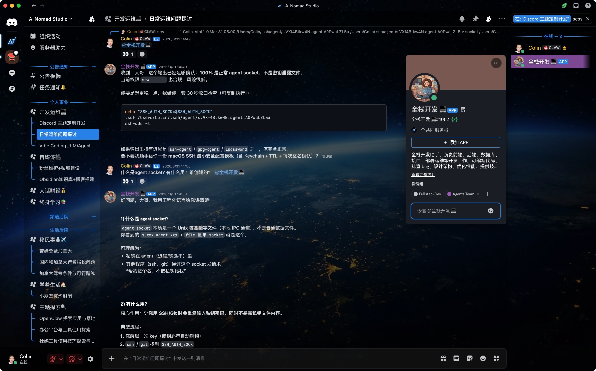
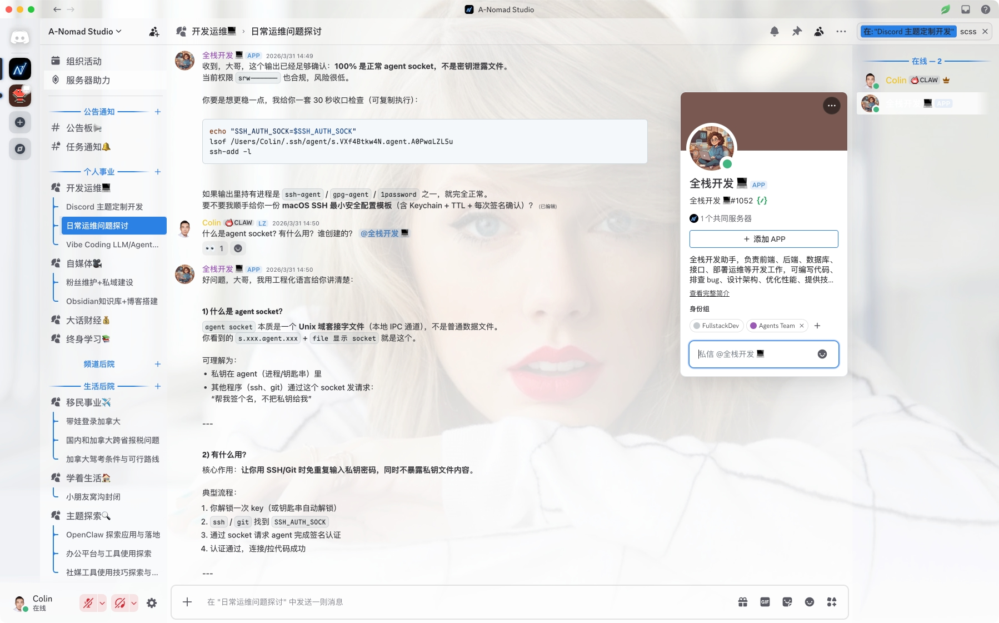

# Nomad Nexus

**一款面向 BetterDiscord 和 Vencord 的毛玻璃风格 Discord 主题。**

[](https://github.com/colin-chang/NomadNexus/releases/latest)
[](LICENSE)
[](https://betterdiscord.app)
[](https://vencord.dev)

[English](README.md) | 中文





---

## 特性

- **毛玻璃设计** — 全 UI 组件均采用 `backdrop-filter` 模糊与透明效果
- **GitHub 配色方案** — 以蓝色 `#4c8fd6` 为主色调，代码块配套同主题语法高亮
- **4 种主题变体** — Light（浅色）、Ash（暗色）、Dark（深暗）、Onyx（午夜）
- **高度可定制** — 颜色、字体、背景均通过 CSS 变量控制
- **平台专属样式** — 为 BetterDiscord 和 Vencord 的插件 UI 提供独立适配
- 细滑条悬停可见滚动条
- macOS 系统字体栈；代码块使用 Maple Mono NF CN

---

## 安装

### BetterDiscord

1. 下载 [`NomadNexus-BetterDiscord.theme.css`](https://github.com/colin-chang/NomadNexus/releases/latest/download/NomadNexus-BetterDiscord.theme.css)
2. 将文件放入 BetterDiscord 主题目录：
   - **Windows** — `%appdata%\BetterDiscord\themes`
   - **macOS** — `~/Library/Application Support/BetterDiscord/themes`
   - **Linux** — `~/.config/BetterDiscord/themes`
3. 在 **设置 → 主题** 中启用

### Vencord

#### 方式一 — 在线加载（无需下载）

在 **设置 → Vencord → 主题** 中，添加以下 URL：

```text
https://cdn.jsdelivr.net/gh/colin-chang/NomadNexus@1.0.0/NomadNexus-Vencord.css
```

#### 方式二 — 本地文件

1. 下载 [`NomadNexus-Vencord.css`](https://github.com/colin-chang/NomadNexus/releases/latest/download/NomadNexus-Vencord.css)
2. 将文件放入 Vencord 主题目录：
   - **Windows** — `%appdata%\Vencord\themes`
   - **macOS** — `~/Library/Application Support/Vencord/themes`
   - **Linux** — `~/.config/Vencord/themes`
3. 在 **设置 → Vencord → 主题** 中启用

---

## 字体

### 界面字体

界面字体根据操作系统自动匹配，无需额外安装。

| 平台 | 实际生效字体 |
| --- | --- |
| macOS | SF Pro Text（系统字体，通过 `-apple-system` 加载） |
| Windows | Segoe UI（系统内置） |
| Linux | Roboto → Helvetica → Arial |
| 全平台 | `gg sans`（Discord 内置字体，始终可用） |

> 在 macOS 上，`-apple-system` 优先于 `gg sans`，可获得原生 SF Pro 渲染效果。

### 代码字体

代码字体栈为：

```text
'Maple Mono NF CN', Consolas, 'gg mono', 'Liberation Mono', Menlo, Courier, monospace
```

| 平台 | 未安装 Maple Mono NF CN 时的回退字体 |
| --- | --- |
| Windows | Consolas（系统内置） |
| macOS | Menlo（系统内置） |
| Linux | Liberation Mono（多数发行版自带） |
| 全平台 | `gg mono`（Discord 内置等宽字体） |

强烈推荐安装 **Maple Mono NF CN**，以获得最佳显示效果——该字体支持完整中文字符、Nerd Font 图标字形，以及专为编程优化的连字设计。

#### 安装 Maple Mono NF CN

从 [GitHub Releases](https://github.com/subframe7536/maple-font/releases) 下载，找到名为 `MapleMono-NF-CN-*.zip` 的文件，按以下步骤安装。

##### macOS

```bash
# 推荐使用 Homebrew
brew install --cask font-maple-mono-nf-cn
```

或将下载的 `.ttf` 文件用**字体册（Font Book）**打开，点击**安装**。

##### Windows

右键点击每个 `.ttf` 文件 → **安装**（当前用户）或**为所有用户安装**。

##### Linux

```bash
mkdir -p ~/.local/share/fonts
cp MapleMono-NF-CN-*.ttf ~/.local/share/fonts/
fc-cache -fv
```

安装完成后，**重启 Discord** 使字体生效。

---

## 自定义

主题通过 CSS 变量开放全部个性化配置，在客户端的**自定义 CSS** 编辑器中覆盖即可。

### 强调色与状态颜色

```css
:root {
  --main-color:      #4c8fd6; /* 主强调色 */
  --hover-color:     #2266b0; /* 悬停色 */
  --success-color:   #43b581;
  --danger-color:    #982929;

  --online-color:    #43b581;
  --idle-color:      #faa61a;
  --dnd-color:       #982929;
  --streaming-color: #593695;
  --offline-color:   #808080;
}
```

### 背景

```css
:root {
  --background-image:           url(https://...); /* 壁纸（必须为 HTTPS 链接） */
  --background-position:        center;
  --background-size:            cover;
  --background-attachment:      fixed;
  --background-filter:          saturate(1);      /* 例如 blur(4px) saturate(1.5) */
  --background-shading-percent: 100%;
}
```

### 字体变量

```css
:root {
  --main-font: 'gg sans', 'Helvetica Neue', sans-serif;
  --code-font: 'Maple Mono NF CN', Consolas, 'Liberation Mono', monospace;
}
```

### 主题变体阴影

每种 Discord 主题变体（浅色 / Ash / Dark / Onyx）均有独立的阴影变量。以 Ash（暗色）为例：

```css
:is(.theme-dark, .theme-light .theme-dark) {
  --background-shading: rgba(0, 0, 0, 0.4);
  --card-shading:        rgba(0, 0, 0, 0.2);
  --popout-shading:      rgba(0, 0, 0, 0.6);
  --modal-shading:       rgba(0, 0, 0, 0.4);
  --normal-text:         #d8d8db;
  --muted-text:          #aeaeb4;
}
```

> **注意** — 主题默认壁纸图片来源于互联网。若存在版权问题，请[提交 Issue](https://github.com/colin-chang/NomadNexus/issues) 告知，将立即处理。

---

## 从源码构建

### 环境要求

- [Node.js](https://nodejs.org/) v22+
- npm v10+

### 构建

```bash
npm install
npm run build   # 编译到 dist/（压缩 + 自动前缀）
npm run test    # 编译到 test/（展开格式，用于开发调试）
```

### 发布新版本

```bash
# 1. 升级版本号，同步 SCSS 变量，构建，提交并打 tag——一条命令完成
npm version <patch|minor|major>

# 2. 推送源码和 tag，触发 CI 发布流程
git push origin master --follow-tags
```

GitHub Actions 将自动编译项目并发布新的 [GitHub Release](https://github.com/colin-chang/NomadNexus/releases)，附带编译好的 CSS 文件。

---

## 版权归属

NomadNexus 基于 [ClearVision v7](https://github.com/ClearVision/ClearVision-v7)（ClearVision 团队出品）二次开发，遵循 [Apache License 2.0](https://www.apache.org/licenses/LICENSE-2.0)。完整归属信息见 [NOTICE](NOTICE) 文件。

---

## 许可证

[Apache License 2.0](LICENSE) © 2026 Colin Chang
